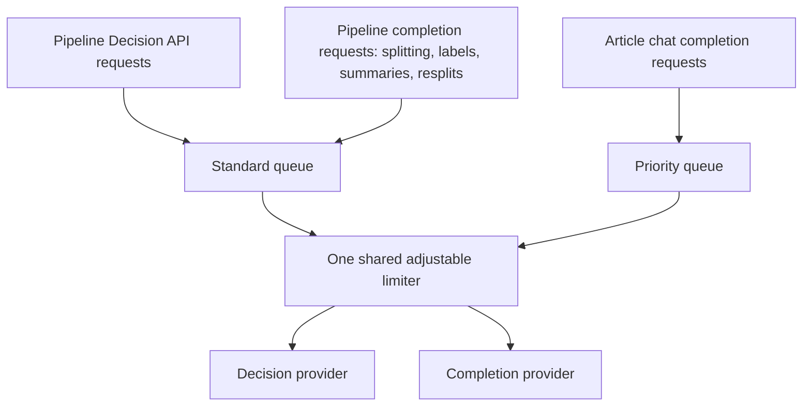

# LLM and Decision API concurrency

Pipeline completion requests and Decision API requests share one concurrency queue across all records being processed by the background service worker. Article chat uses the same queue with higher priority. The queue is not keyed by provider, model, or server URL: requests to different servers still compete for the same capacity.

Entrypoint: [`src/extension/background/background.js`](../src/extension/background/background.js) (queue construction and wiring); [`src/extension/background/pipeline/orchestrator.js`](../src/extension/background/pipeline/orchestrator.js) (pipeline request wrappers).

## Shared capacity

The `pagetollm-max-parallel-llm-requests` setting defaults to **4** and is normalized to an integer between **1 and 16**. The background service constructs one `createAdjustableLimiter` with `reservedPrioritySlots: 1`. Pipeline completion and decision requests enter its standard lane; chat requests enter its priority lane.

| Configured limit | Maximum pipeline completion + decision tasks combined | Maximum total tasks including chat |
| ---------------- | ----------------------------------------------------- | ---------------------------------- |
| 1                | 1                                                     | 1                                  |
| 4 (default)      | 3                                                     | 4                                  |
| 8                | 7                                                     | 8                                  |
| 16               | 15                                                    | 16                                 |

For a limit greater than one, pipeline work can occupy at most `limit - 1` slots. The reserved slot stays unavailable to pipeline work even when chat is idle. Chat can use any free slot, including the reserved slot, and can occupy the entire configured capacity. At a limit of one, both lanes remain enabled and share the single slot.

At the default setting, two completion tasks plus one decision task fill pipeline capacity. Another pipeline task of either type waits. A chat task can still start in the fourth slot.

Queued chat tasks are selected before queued pipeline tasks. Each lane is FIFO; completion and decision tasks have equal priority within the pipeline lane. Running tasks are not preempted. There is no per-provider, per-record, or per-request-type quota, so a busy record or slow decision server can delay other records' completion requests. Sustained chat traffic can delay pipeline work.

The orchestrator reads the setting at pipeline start and subscribes to changes. Raising the limit admits queued work immediately; lowering it lets running tasks finish and delays new work until capacity permits. Existing tasks are not cancelled, so active tasks can temporarily exceed a newly lowered cap.

Implementation: [`llmConcurrency.js`](../src/core/settings/llmConcurrency.js), [`concurrency.js`](../src/core/llm/concurrency.js).

## Request flow and local limits

When a decision provider is saved, one article first runs decision boundary detection, then completion-based range labeling, then summaries. These stages do not overlap within that normal article flow, but different articles can be in different stages simultaneously.

- **Decision boundaries:** batches are awaited sequentially, so one article has at most one decision request active at a time. The default batch contains up to **8 boundary questions** in one API request. Eight questions consume one shared slot, not eight. See [`decisionTopicBoundaries.js`](../src/core/pipeline/decisionTopicBoundaries.js).
- **Topic splitting, labeling, and manual resplits:** local worker concurrency is **4** (`TOPIC_RANGE_CONCURRENCY`). Without a decision provider, completion requests perform topic splitting directly. See [`topicRangeSplit.js`](../src/core/pipeline/topicRangeSplit.js), [`topicRangeLabels.js`](../src/core/pipeline/topicRangeLabels.js), and [`topicRangeResplit.js`](../src/core/pipeline/topicRangeResplit.js).
- **Summaries:** local request concurrency is **4** (`SUMMARY_CONCURRENCY`), with local limiters around source summary and merge calls. See [`summaryStage.js`](../src/core/pipeline/summaryStage.js) and [`sourceSummarizer.js`](../src/core/pipeline/sourceSummarizer.js).

Local caps bound how much work a stage submits; they do not allocate additional global capacity. Multiple records cannot multiply the shared cap. Some completion bursts run the first item to completion before starting parallel workers to warm the provider's prompt cache. This temporarily reduces concurrency further. Constants live in [`pipelineConfig.js`](../src/core/pipeline/pipelineConfig.js); warmup behavior lives in [`providerBurst.js`](../src/core/pipeline/providerBurst.js).

## Slot lifetime, retries, and cancellation

Pipeline completion and chat tasks hold a shared slot for the entire provider retry loop, including backoff sleeps. An occupied slot therefore does not necessarily mean an HTTP request is currently in flight. A completion provider backing off can reduce capacity available to the decision server as well.

Decision calls have no automatic transport retry and default to a **60-second timeout**. Boundary detection retries oversized inputs with smaller batches, then without surrounding context if necessary. Each such attempt separately enters the shared limiter; other failures propagate to pipeline recovery. The decision path starts boundary detection again on retry rather than resuming a boundary checkpoint.

Queued requests with an abort signal can be removed immediately on cancellation without consuming a slot. Once started, the underlying request or retry loop handles cancellation; the limiter releases capacity when that task settles.

Implementation: [`orchestrator.js`](../src/extension/background/pipeline/orchestrator.js), [`chatCompletionService.js`](../src/extension/background/chatCompletionService.js), [`decisionClient.js`](../src/core/llm/decisionClient.js), and [`topicRangesStage.js`](../src/core/pipeline/topicRangesStage.js).

## Guidance for code changes

The shared limit is enforced by the background wrappers, not inside `callLLMWithRetry` or `DecisionClient` themselves. New provider-facing paths must use the shared limiter explicitly to participate in this budget. Creating a new limiter per record or per request would create independent capacity instead of sharing the existing queue.

Relevant tests: [`concurrency.test.js`](../src/core/llm/concurrency.test.js) covers aggregate capacity and chat reservation; [`orchestrator.test.js`](../src/extension/background/pipeline/orchestrator.test.js) covers setting updates and decision requests entering the shared limiter. These tests do not explicitly exercise simultaneous completion and decision traffic competing for slots.
