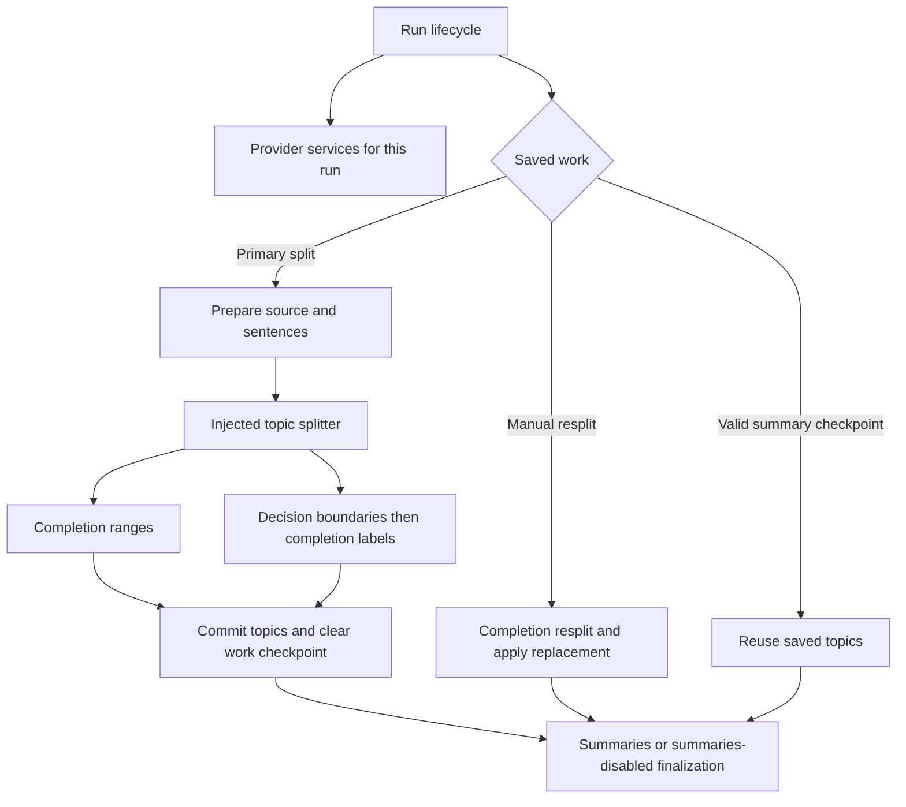

# Pipeline composition

The pipeline supports two primary topic splitters as permanent alternatives. The completion splitter discovers boundaries and names topics in one pass. The decision splitter classifies sentence gaps, assembles ranges deterministically, and uses the completion provider to name them. Both return the same labelled groups with zero-based inclusive sentence ranges.

## Responsibilities

| Module                                | Responsibility                                                                                                                                    |
| ------------------------------------- | ------------------------------------------------------------------------------------------------------------------------------------------------- |
| Background composition root           | Supplies storage, settings, provider factories, telemetry, and the shared request limiter.                                                        |
| `pipeline/orchestrator.js`            | Owns a run's lifecycle: classify resume, dispatch primary splitting or manual resplit, carry summary checkpoints, finalize, and recover failures. |
| `pipeline/pipelineProviders.js`       | Binds requests to provider snapshots; owns dispatch through the shared limiter, measurement, budgets, and provider cache identities.              |
| `core/pipeline/topicRangesStage.js`   | Normalizes captured text, prepares sentences, invokes an injected splitter, and commits topics before summaries.                                  |
| `core/pipeline/topicSplitter.js`      | Composes the two primary splitter implementations behind `split({ runtime, record, text, sentenceObjs, sentenceTexts })`.                         |
| `core/pipeline/topicRangeSplit.js`    | Completion splitting, bounded chunks, parsing, selective retries, and chunk completion callbacks. Also serves manual resplits.                    |
| `core/pipeline/decisionTopicSplit.js` | Composes boundary detection, labeling, resumable decision work, and sibling cancellation.                                                         |
| `core/pipeline/summaryStage.js`       | Composes source summaries and hierarchy merging, including summary recovery and finalization.                                                     |
| `pipeline/pipelineRuntime.js`         | Enforces storage ownership and user cancellation, and provides persistence and logging capabilities.                                              |

Paths prefixed with `pipeline/` are under `src/extension/background/`.

## Lifecycle and persistence contracts

A selected decision provider is resolved and its client constructed only for primary splitting. A summary resume or manual resplit never reads decision-provider configuration. Configuration errors from an unused splitter therefore cannot prevent those operations. Primary splitting still fails visibly for a misconfigured selected provider; it does not silently switch strategies.

The completion provider is read once per run. Its snapshot determines request dispatch, input budgets, and summary cache identity. A primary split also binds its decision provider once. Both request types enter the same externally owned limiter, with normalized server and record keys. `pipeline_start` records the lifecycle start; `topic_splitter_selected` records the strategy and decision-provider metadata only on the primary path.

Source preparation preserves sentence offsets and continuation metadata for the splitter. Persisted topic sentence references remain one-based. The topic stage alone converts the groups into stored topics and clears intermediate work in the final content write. Empty input finalizes without invoking a splitter.

Intermediate checkpoints belong to each strategy. Completion chunks and decision answers/labels share the existing topic work document but validate their own schema and identity. Decision checkpoints require matching source, content revision, provider policy, and labeling policy. The serialized writer prevents older snapshots overwriting newer work. No persisted schema change or migration is needed for this refactor.

The strategies intentionally retain different failure policies. Completion splitting preserves successful chunks and selectively retries failures. Decision splitting stops sibling requests after a terminal failure and drains them before propagating the original error. Its completed checkpoint writes use the parent runtime, so sibling cancellation cannot discard paid-for work; user cancellation and lost run ownership still prevent writes. These policies belong to the implementations rather than a universal stage executor.

## Architectural assessment and extension rules

The existing transport client, bounded decision batching, sentence continuation handling, shared limiter, and restart checkpoints already provide useful separation and recovery guarantees. The integration problem was that provider wiring and decision policy leaked into the lifecycle orchestrator and the source-preparation stage. Explicit composition removes those dependencies without replacing established retry and summary machinery.

The splitter contract is a small strategy interface, not a workflow engine. A new primary implementation must return labelled ranges in the prepared sentence coordinate system, own its intermediate checkpoint validation, and use injected request capabilities. It can then be composed without changing source preparation or final topic persistence. No class hierarchy, dynamic registry, or generic stage graph is required.

Manual resplit remains a separate operation: its prompt and result application preserve a selected topic's hierarchy and surrounding summaries. Applying primary decision segmentation there would require defining a new resplit policy, not simply switching the selected splitter. Summary generation likewise keeps its existing source-unit and hierarchy architecture.

The decision checkpoint currently binds boundaries and labels to one identity. Changing the labeling provider invalidates both, which is conservative and safe but can repeat boundary requests. Separate boundary and label identities are a possible cost optimization if this becomes significant; they would require explicit schema/version and recovery tests. Persistent checkpoint size and throughput should also be measured on large articles before introducing more elaborate storage machinery.

Tests cover both real splitter compositions, provider routing and identities, checkpoint reuse/invalidation, partial successes, sibling cancellation, and lifecycle paths that must not initialize the decision provider. The provider adapter tests use the actual decision and labeling stages; the source-stage contract is also exercised with an injected splitter.
